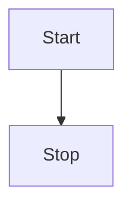

# 图像增强

## 设置大小


## 设置相对大小&绝对大小


## 设置图片对齐方式

### 参数说明

| 参数| 说明| 位置| 
| ------ | ------ | ------ |
| `#100px` 或 `#10%` 或 `#auto` | 宽度 | 第一个 | 
| `#100px` 或 `#10%` 或 `#auto` | 高度 | 第二个 | 
| `#left` | 左对齐 | 任意 | 
| `#center` | 居中 | 任意 | 
| `#right` | 右对齐 | 任意 | 
| `#float-left` | 悬浮左对齐 | 任意 | 
| `#float-right` | 悬浮右对齐 |任意 | 
| `#border` 或 `#B` | 边框 | 任意 | 
| `#shadow` 或 `#S` | 阴影 | 任意 | 
| `#radius` 或 `#R` | 圆角 | 任意 | 


### 左对齐+边框


### 居中+边框+阴影


### 右对齐+边框+阴影+圆角


### 浮动左对齐+边框+阴影+圆角


开心也是一天，不开心也是一天


# 表格增强


##  折线图表格


| :line: {x,y} | a | b | c |
| :-: | :-: | :-: | :-: |
| x | 1 | 2 | 3 |
| y | 2 | 4 | 6 |
| z | 7 | 5 | 3 |


# 音频


!audio[描述](http://music.163.com/song/media/outer/url?id=29095562.mp3)


# 视频


!video[不带封面演示视频](https://tencent.github.io/cherry-markdown/examples/assets/images/demo.mp4)
!video[带封面演示视频](https://tencent.github.io/cherry-markdown/examples/assets/images/demo.mp4){poster=https://dummyimage.com/640x4:3/}


# 文件


!file[文件名|类型|密码](https://tencent.github.io/cherry-markdown/examples/assets/images/demo.mp4)

!file[文件名|mp3](https://tencent.github.io/cherry-markdown/examples/assets/images/demo.mp4)

!file[文件名|mp4](https://tencent.github.io/cherry-markdown/examples/assets/images/demo.mp4)


# Iframe嵌入

<!-- 原生iframe示例 -->
<iframe src="https://example.com" width="100%" height="400" style="border:none; margin: 1em 0;"></iframe>

<!-- Cherry简写语法示例 -->
@@https://example.com

# 卡片

## 普通卡片

```card
#list
[Cherry Editor](https://example.com) 新一代Markdown编辑器
[使用文档](https://example.com) 完整的使用说明和API文档
[在线演示](https://example.com) 立即体验编辑器功能
```

## 无图卡片
```card
#list/1
[技术支持](https://example.com) 获取专业的技术支持服务
[问题反馈](https://example.com) 提交问题或建议
```

## 图文卡片
```card
#image/3
[功能演示](https://example.com) 查看核心功能演示
[主题商店](https://example.com) 选择你喜欢的界面主题
[APP下载](https://example.com) 获取移动端应用程序
```

# Latex语法支持

> 详细参考：[latexlive](https://www.latexlive.com/)

行内：$x^2$

Latex语法块：
$$
x^2
$$


# Mermaid语法支持

> 详细参考：[mermaid官网](https://mermaid.js.org/syntax/flowchart.html)



# Echarts语法支持

> 详细参考：[echarts官网](https://echarts.apache.org/handbook/zh/concepts/chart-size) ，只需提供`options`选项即可。

```echarts
{
  "xAxis": {
    "data": [
      "Mon",
      "Tue",
      "Wed",
      "Thu",
      "Fri",
      "Sat",
      "Sun"
    ]
  },
  "yAxis": {},
  "series": [
    {
      "type": "bar",
      "data": [
        23,
        24,
        18,
        25,
        27,
        28,
        25
      ]
    }
  ]
}
```

