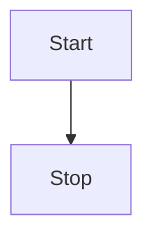

::: tip 提示
此处的语法兼容大多数Markdown编辑器（Typora、Github等）。
:::


# 标题

```markdown
# heading 1
## heading 2
### heading 3
#### heading 4
##### heading 5
###### heading 6
Heading level 1
===============
Heading level 2
---------------
```

++- 语法演示
# heading 1

## heading 2

### heading 3

#### heading 4

##### heading 5

###### heading 6

Heading level 1
===============
Heading level 2
---------------
+++

# 斜体

```markdown
_斜体_
*斜体*
```

++- 语法演示
_斜体_
*斜体*
+++

# 粗体

```markdown
__粗体__
**粗体**
```

++- 语法演示
__粗体__
**粗体**
+++

# 粗体和斜体

```markdown
___粗体和斜体___
***粗体和斜体***
__*粗体和斜体*__
_**粗体和斜体**_
**_粗体和斜体_**
```

++- 语法演示
___粗体和斜体___
***粗体和斜体***
__*粗体和斜体*__
_**粗体和斜体**_
**_粗体和斜体_**
+++

## 引用

```markdown
> 引用文本
>> 嵌套引用
```

++- 语法演示
> 引用文本
>> 嵌套引用
> >
+++

# 列表

## 无序列表

```markdown
- 文本一
- 文本二
- 文本三
```

++- 语法演示
- 文本一
- 文本二
- 文本三

+++

## 有序列表

```markdown
1. 文本一
2. 文本二
3. 文本三
```

++- 语法演示

1. 文本一
2. 文本二
3. 文本三

+++

# 代码块

````markdown
```html
<html>
   <head>
     <title>Test</title>
   </head>
   </html>
```
````

++- 语法演示

```html
<html>
<head>
    <title>Test</title>
</head>
```

+++

# 行内代码

```markdown
`test`
```

++- 语法演示
`test`
+++

# 转义反引号

```markdown
``Use `code` in your Markdown file.``
```

++- 语法演示
``Use `code` in your Markdown file.``
+++

# 图片

```markdown

```

++- 语法演示

+++

# 水平线

```markdown
****
----
____
```


++- 语法演示

****

----

___
+++


# 链接

## 添加标题

```markdown
My favorite search engine is [Duck Duck Go](https://duckduckgo.com).
```

++- 语法演示
My favorite search engine is [Duck Duck Go](https://duckduckgo.com).
+++

## URL

```markdown
<https://www.markdownguide.org>
<fake@example.com>
```

++- 语法演示
<https://www.markdownguide.org>
<fake@example.com>
+++

### 格式化链接

```markdown
I love supporting the **[EFF](https://eff.org)**.
This is the *[Markdown Guide](https://www.markdownguide.org)*.
See the section on [`code`](#code).

```

++- 语法演示
I love supporting the **[EFF](https://eff.org)**.
This is the *[Markdown Guide](https://www.markdownguide.org)*.
See the section on [`code`](#code).
+++


::: tip 提示
此处的语法是大部分编辑器（Typora、Githubd）可使用的语法。
:::
# 表格
## 常规表格

```markdown
| Syntax      | Description |
| ----------- | ----------- |
| Header      | Title       |
| Paragraph   | Text        |
```

++- 语法演示
| Syntax | Description |
| ----------- | ----------- |
| Header | Title |
| Paragraph | Text |
+++

## 对齐
```markdown
| Syntax      | Description | Test Text     |
| :---        |    :----:   |          ---: |
| Header      | Title       | Here's this   |
| Paragraph   | Text        | And more      |

```
++- 语法演示
| Syntax | Description | Test Text |
| :--- |    :----:   | ---: |
| Header | Title | Here's this |
| Paragraph | Text | And more |
+++

# 删除线

```markdown
~~The world is flat.~~ We now know that the world is round.
```

++- 语法演示
~~The world is flat.~~ We now know that the world is round.
+++

# 任务列表

```markdown
- [x] Write the press release
- [ ] Update the website
- [ ] Contact the media
```

++- 语法演示

- [ ] Write the press release
- [x] Update the website
- [ ] Contact the media

+++

# 表情符号

```markdown
Gone camping! :tent: Be back soon.

That is so funny! :joy:
```

++- 语法演示
Gone camping! :tent: Be back soon.
That is so funny! :joy:
+++

# 突出显示

```markdown
I need to highlight these ==very important words==.
I need to highlight these <mark>very important words</mark>.
```

++- 语法演示
I need to highlight these ==very important words==.
I need to highlight these <mark>very important words</mark>.
+++

# 下标

```markdown
H<sub>2</sub>O
H^^2^^O
```

++- 语法演示
H<sub>2</sub>O
H^^2^^O
+++

# 上标

```markdown
X<sup>2</sup>
X^2^
```

++- 语法演示
X<sup>2</sup>
X^2^
+++

# 下划线

```markdown
Some of these words <ins>will be underlined</ins>.
Some of these words /will/ be underlined.
```

++- 语法演示
Some of these words <ins>will be underlined</ins>.
Some of these words /will/ be underlined/.
+++

# 中心

```markdown
<center>This text is centered.</center>
```

++- 语法演示
<center>This text is centered.</center>
+++

# 颜色

```markdown
<font color="red">This text is red!</font>
```

++- 语法演示
<font color="red">This text is red!</font>
+++


::: warning 警告
此处的语法仅 Cherry Muse 或 Cherry Markdown 支持。
:::

# 目录

```markdown
[[toc]]
```
++- 语法演示
[[toc]]
+++

# 字体增强
## 字体大小
```markdown
鞋子 !32 特大号!
# !大小 文本!
```
++- 语法演示
鞋子 !32 特大号!
+++
## 字体颜色

```markdown
!!#ff0000 字体颜色!!
!!!#f9cb9c 背景颜色!!!
[!!#ffffff !!!#000000 黑底白字超链接!!!!!](http://www.qq.com)
```
++- 语法演示
!!#ff0000 字体颜色!!
!!!#f9cb9c 背景颜色!!!
[!!#ffffff !!!#000000 黑底白字超链接!!!!!](http://www.qq.com)
+++

# 超链接增强
## 自动识别
```markdown
https://www.qq.com?param=中文
```
++- 语法演示
https://www.qq.com?param=中文
+++

## 引用链接

```markdown
这是一个[引用一个链接]
[引用一个链接]: https://www.qq.com
```
++- 语法演示
这是一个[引用一个链接]
[引用一个链接]: https://www.qq.com
+++

# 图像增强

## 设置大小

```markdown

```

++- 语法演示

+++

## 设置相对大小&绝对大小

```markdown

```

++- 语法演示

+++

## 设置图片对齐方式

### 参数说明

| 参数| 说明| 位置| 
| ------ | ------ | ------ |
| `#100px` 或 `#10%` 或 `#auto` | 宽度 | 第一个 | 
| `#100px` 或 `#10%` 或 `#auto` | 高度 | 第二个 | 
| `#left` | 左对齐 | 任意 | 
| `#center` | 居中 | 任意 | 
| `#right` | 右对齐 | 任意 | 
| `#float-left` | 悬浮左对齐 | 任意 | 
| `#float-right` | 悬浮右对齐 |任意 | 
| `#border` 或 `#B` | 边框 | 任意 | 
| `#shadow` 或 `#S` | 阴影 | 任意 | 
| `#radius` 或 `#R` | 圆角 | 任意 | 


### 左对齐+边框

```markdown

```

++- 语法演示

+++

### 居中+边框+阴影

```markdown

```

++- 语法演示

+++

### 右对齐+边框+阴影+圆角

```markdown

```

++- 语法演示

+++


### 浮动左对齐+边框+阴影+圆角

```markdown

开心也是一天，不开心也是一天
```

++- 语法演示

开心也是一天，不开心也是一天
+++


# 表格增强  [[Pro:tip,top]]

这是 Cherry Markdown 中未开放的功能。

##  折线图表格

```markdown
| :line: {x,y} | a | b | c |
| :-: | :-: | :-: | :-: |
| x | 1 | 2 | 3 |
| y | 2 | 4 | 6 |
| z | 7 | 5 | 3 |
```

++- 语法演示


| :line: {x,y} | a | b | c |
| :-: | :-: | :-: | :-: |
| x | 1 | 2 | 3 |
| y | 2 | 4 | 6 |
| z | 7 | 5 | 3 |


+++

##  柱状图表格

```markdown
| :bar: {x,y} | a | b | c |
| :-: | :-: | :-: | :-: |
| x | 1 | 2 | 3 |
| y | 2 | 4 | 6 |
| z | 7 | 5 | 3 |
```

++- 语法演示


| :bar: {x,y} | a | b | c |
| :-: | :-: | :-: | :-: |
| x | 1 | 2 | 3 |
| y | 2 | 4 | 6 |
| z | 7 | 5 | 3 |


+++


# 面板

面板功能可以用来标注重点提示的信息。

```markdown
::: info 标题
内容
:::
::: warning 标题
内容
:::
::: danger 标题
内容
:::
::: success 标题
内容
:::
::: left 标题
内容
:::
::: center 标题
内容
:::
::: right 标题
内容
:::
```

语法演示

::: info 标题
内容
:::
::: warning 标题
内容
:::
::: danger 标题
内容
:::
::: success 标题
内容
:::
::: left 标题
内容
:::
::: center 标题
内容
:::
::: right 标题
内容
:::

# 手风琴（详细块）

```markdown
++- 点击展开更多
内容
++- 默认展开
内容
++ 默认收起
内容
+++
```

语法演示
++- 点击展开更多
内容
++- 默认展开
内容
++ 默认收起
内容
+++


++- 默认展开
内容
++ 默认收起
内容
+++

++ 默认收起
内容
+++

# 待办清单
```
- [x] Item 1
    - [x] Item 1.1
- [x] Item 2
```

++- 语法演示

- [x] Item 1
  - [x] Item 1.1
- [x] Item 2

+++

# 音频

```
!audio[描述](链接)
```

++- 语法演示

!audio[描述](链接)

+++

# 视频

```
!video[不带封面演示视频](链接)
!video[带封面演示视频](链接){poster=https://wiki.ankio.net/file/upload_6574546916e75.png}
```

++- 语法演示

!video[不带封面演示视频](链接)
!video[带封面演示视频](链接){poster=https://wiki.ankio.net/file/upload_6574546916e75.png}

+++

# 文件

```markdown
!file[文件名|类型|密码](链接)
```
++- 语法演示

!file[文件名|类型|密码](链接)

!file[文件名|mp3](链接)

!file[文件名|mp4](链接)

+++

# 徽章


```markdown
[[内容:tip,top]]
[[内容:info,top]]
[[内容:warning,top]]
[[内容:danger,top]]
[[内容:note,top]]
[[内容:#000000|bottom]]
```

++- 语法演示
[[内容:tip,top]]
[[内容:info,top]]
[[内容:warning,top]]
[[内容:danger,top]]
[[内容:note,top]]
[[内容:#000000|bottom]]
+++

# Emoji表情

::: warning 警告
Cherry Muse不能完全支持所有的Emoji（未经过完全测试）。
:::

```markdown
:+1:
```

++- 语法演示
:+1:
+++

# 卡片

## 普通卡片
````markdown
```card
{
  "count": 3,
  "type": "card",
  "data": [
    {
      "name": "麋鹿鲁哟",
      "desc": "大道至简，知易行难",
      "avatar": "https://jsd.cdn.zzko.cn/gh/xugaoyi/image_store/blog/20200122153807.jpg",
      "link": "https://www.cnblogs.com/miluluyo/",
      "bgColor": "#CBEAFA",
      "textColor": "#6854A1"
    },
    {
      "name": "XAOXUU",
      "desc": "#IOS #Volantis主题作者",
      "avatar": "https://jsd.cdn.zzko.cn/gh/xaoxuu/assets@master/avatar/avatar.png",
      "link": "https://xaoxuu.com",
      "bgColor": "#718971",
      "textColor": "#fff"
    },
    {
      "name": "平凡的你我",
      "desc": "理想成为大牛的小陈同学",
      "avatar": "https://reinness.com/avatar.png",
      "link": "https://reinness.com",
      "bgColor": "#FCDBA0",
      "textColor": "#A05F2C"
    }
  ]
}
```

````

++- 语法演示
```card
{
  "count": 3,
  "type": "card",
  "data": [
    {
      "name": "麋鹿鲁哟",
      "desc": "大道至简，知易行难",
      "avatar": "https://jsd.cdn.zzko.cn/gh/xugaoyi/image_store/blog/20200122153807.jpg",
      "link": "https://www.cnblogs.com/miluluyo/",
      "bgColor": "#CBEAFA",
      "textColor": "#6854A1"
    },
    {
      "name": "XAOXUU",
      "desc": "#IOS #Volantis主题作者",
      "avatar": "https://jsd.cdn.zzko.cn/gh/xaoxuu/assets@master/avatar/avatar.png",
      "link": "https://xaoxuu.com",
      "bgColor": "#718971",
      "textColor": "#fff"
    },
    {
      "name": "平凡的你我",
      "desc": "理想成为大牛的小陈同学",
      "avatar": "https://reinness.com/avatar.png",
      "link": "https://reinness.com",
      "bgColor": "#FCDBA0",
      "textColor": "#A05F2C"
    }
  ]
}
```
+++

## 无图卡片

````markdown
```card
{
  "count": 2,
  "type": "card",
  "data": [
    {
      "name": "《静夜思》",
      "desc": "床前明月光，疑是地上霜。举头望明月，低头思故乡。",
      "bgColor": "#F0DFB1",
      "textColor": "#242A38"
    },
    {
      "name": "Vdoing",
      "desc": "🚀一款简洁高效的VuePress 知识管理&博客(blog) 主题",
      "link": "https://github.com/xugaoyi/vuepress-theme-vdoing",
      "bgColor": "#DFEEE7",
      "textColor": "#2A3344"
    }
  ]
}
```
````

++- 语法演示
```card
{
  "count": 2,
  "type": "card",
  "data": [
    {
      "name": "《静夜思》",
      "desc": "床前明月光，疑是地上霜。举头望明月，低头思故乡。",
      "bgColor": "#F0DFB1",
      "textColor": "#242A38"
    },
    {
      "name": "Vdoing",
      "desc": "🚀一款简洁高效的VuePress 知识管理&博客(blog) 主题",
      "link": "https://github.com/xugaoyi/vuepress-theme-vdoing",
      "bgColor": "#DFEEE7",
      "textColor": "#2A3344"
    }
  ]
}
```
+++

## 图文卡片

````markdown
```card
{
  "count": 3,
  "type": "cardImage",
  "data": [
    {
      "img": "https://jsd.cdn.zzko.cn/gh/xugaoyi/image_store/blog/20200529162253.jpg",
      "link": "https://xugaoyi.com/",
      "name": "标题",
      "desc": "描述内容描述内容描述内容描述内容描述内容描述内容描述内容描述内容",
      "author": "Evan Xu",
      "avatar": "https://jsd.cdn.zzko.cn/gh/xugaoyi/image_store/blog/20200103123203.jpg"
    },
    {
      "img": "https://jsd.cdn.zzko.cn/gh/xugaoyi/image_store/blog/20200530100256.jpg",
      "link": "https://xugaoyi.com/",
      "name": "标题",
      "desc": "描述内容描述内容描述内容描述内容描述内容描述内容描述内容描述内容",
      "author": "Evan Xu",
      "avatar": "https://jsd.cdn.zzko.cn/gh/xugaoyi/image_store/blog/20200103123203.jpg"
    },
    {
      "img": "https://jsd.cdn.zzko.cn/gh/xugaoyi/image_store/blog/20200530100257.jpg",
      "link": "https://xugaoyi.com/",
      "name": "标题",
      "desc": "描述内容描述内容描述内容描述内容描述内容描述内容描述内容描述内容",
      "author": "Evan Xu",
      "avatar": "https://jsd.cdn.zzko.cn/gh/xugaoyi/image_store/blog/20200103123203.jpg"
    }
  ]
}
```

````

++- 语法演示
```card
{
  "count": 3,
  "type": "cardImage",
  "data": [
    {
      "img": "https://jsd.cdn.zzko.cn/gh/xugaoyi/image_store/blog/20200529162253.jpg",
      "link": "https://xugaoyi.com/",
      "name": "标题",
      "desc": "描述内容描述内容描述内容描述内容描述内容描述内容描述内容描述内容",
      "author": "Evan Xu",
      "avatar": "https://jsd.cdn.zzko.cn/gh/xugaoyi/image_store/blog/20200103123203.jpg"
    },
    {
      "img": "https://jsd.cdn.zzko.cn/gh/xugaoyi/image_store/blog/20200530100256.jpg",
      "link": "https://xugaoyi.com/",
      "name": "标题",
      "desc": "描述内容描述内容描述内容描述内容描述内容描述内容描述内容描述内容",
      "author": "Evan Xu",
      "avatar": "https://jsd.cdn.zzko.cn/gh/xugaoyi/image_store/blog/20200103123203.jpg"
    },
    {
      "img": "https://jsd.cdn.zzko.cn/gh/xugaoyi/image_store/blog/20200530100257.jpg",
      "link": "https://xugaoyi.com/",
      "name": "标题",
      "desc": "描述内容描述内容描述内容描述内容描述内容描述内容描述内容描述内容",
      "author": "Evan Xu",
      "avatar": "https://jsd.cdn.zzko.cn/gh/xugaoyi/image_store/blog/20200103123203.jpg"
    }
  ]
}
```
+++

# Latex语法支持

详细参考：[latexlive](https://www.latexlive.com/)

```markdown
$x^2$

$$
x^2
$$

```

++- 语法演示
行内：$x^2$

Latex语法块：
$$
x^2
$$

+++

# Mermaid语法支持

详细参考：[mermaid官网](https://mermaid.js.org/syntax/flowchart.html)

````markdown

````

++- 语法演示

+++


# Echarts语法支持

详细参考：[echarts官网](https://echarts.apache.org/handbook/zh/concepts/chart-size) ，只需提供`options`选项即可。

````markdown
```echarts
{
  "xAxis": {
    "data": [
      "Mon",
      "Tue",
      "Wed",
      "Thu",
      "Fri",
      "Sat",
      "Sun"
    ]
  },
  "yAxis": {},
  "series": [
    {
      "type": "bar",
      "data": [
        23,
        24,
        18,
        25,
        27,
        28,
        25
      ]
    }
  ]
}
```
````

++- 语法演示

```echarts
{
  "xAxis": {
    "data": [
      "Mon",
      "Tue",
      "Wed",
      "Thu",
      "Fri",
      "Sat",
      "Sun"
    ]
  },
  "yAxis": {},
  "series": [
    {
      "type": "bar",
      "data": [
        23,
        24,
        18,
        25,
        27,
        28,
        25
      ]
    }
  ]
}
```

+++

# 脚注

```markdown
此处是个[^脚注标题]
[^脚注标题]: 脚注内容…
```

++- 语法演示
此处是个[^脚注标题]
[^脚注标题]: 脚注内容…
+++


