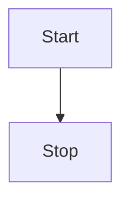

---
lang: frontMatterSupport
meta:
  - name: 支持frontMatter语法
    content: hello
  - name: keywords
    content: super duper SEO
---	

# 支持frontMatter语法

使用变量访问效果 {{ lang }}，就像我说的一样：{{ meta.0.name }}

> 也可以在js中使用`Cherry.frontMatter`访问frontMatter变量


::: tip 提示
此处的语法兼容大多数Markdown编辑器（Typora、Github等）。
:::


# 标题

# heading 1

## heading 2

### heading 3

#### heading 4

##### heading 5

###### heading 6

Heading level 1
===============
Heading level 2
---------------

# 斜体

_斜体_
*斜体*

# 粗体

__粗体__
**粗体**

# 粗体和斜体

___粗体和斜体___
***粗体和斜体***
__*粗体和斜体*__
_**粗体和斜体**_
**_粗体和斜体_**


## 引用

> 引用文本
>> 嵌套引用

# 列表

## 无序列表

- 文本一
- 文本二
- 文本三

## 有序列表

1. 文本一
2. 文本二
3. 文本三

# 代码块

```html
<html>
<head>
  <title>Test</title>
</head>
</html>
```


# 行内代码

`test`

# 转义反引号

``Use `code` in your Markdown file.``

# 图片


# 水平线

****

----

___


# 链接

## 添加标题

My favorite search engine is [Duck Duck Go](https://duckduckgo.com).

## URL

<https://www.markdownguide.org>
<fake@example.com>

### 格式化链接

I love supporting the **[EFF](https://eff.org)**.
This is the *[Markdown Guide](https://www.markdownguide.org)*.
See the section on [`code`](#code).


::: tip 提示
此处的语法是大部分编辑器（Typora、Githubd）可使用的语法。
:::
# 表格
## 常规表格

| Syntax      | Description |
| ----------- | ----------- |
| Header      | Title       |
| Paragraph   | Text        |

## 对齐

| Syntax      | Description | Test Text     |
| :---        |    :----:   |          ---: |
| Header      | Title       | Here's this   |
| Paragraph   | Text        | And more      |

# 删除线

~~The world is flat.~~ We now know that the world is round.

# 任务列表

- [x] Write the press release
- [ ] Update the website
- [ ] Contact the media


# 表情符号

Gone camping! :tent: Be back soon.

That is so funny! :joy:is so funny! :joy:

# 突出显示

I need to highlight these ==very important words==.
I need to highlight these <mark>very important words</mark>.

# 下标

H<sub>2</sub>O
H^^2^^O

# 上标

X<sup>2</sup>
X^2^

# 下划线

Some of these words <ins>will be underlined</ins>.
Some of these words /will/ be underlined.

# 中心

<center>This text is centered.</center>

# 颜色

<font color="red">This text is red!</font>

# 字体大小

鞋子 !32 特大号!
# !大小 文本!

::: warning 警告
此处的语法仅 Cherry Muse 或 Cherry Markdown 支持。
:::

# 目录

[[toc]]

# 字体增强
## 字体大小

鞋子 !32 特大号!
>  !大小 文本!


## 字体颜色

!!#ff0000 字体颜色!!
!!!#f9cb9c 背景颜色!!!
[!!#ffffff !!!#000000 黑底白字超链接!!!!!](http://www.qq.com)


# 超链接增强
## 自动识别

https://example.com?param=中文


## 引用链接


这是一个[引用一个链接]
[引用一个链接]: https://example.com


# 图像增强

## 设置大小


## 设置相对大小&绝对大小


## 设置图片对齐方式

### 参数说明

| 参数| 说明| 位置| 
| ------ | ------ | ------ |
| `#100px` 或 `#10%` 或 `#auto` | 宽度 | 第一个 | 
| `#100px` 或 `#10%` 或 `#auto` | 高度 | 第二个 | 
| `#left` | 左对齐 | 任意 | 
| `#center` | 居中 | 任意 | 
| `#right` | 右对齐 | 任意 | 
| `#float-left` | 悬浮左对齐 | 任意 | 
| `#float-right` | 悬浮右对齐 |任意 | 
| `#border` 或 `#B` | 边框 | 任意 | 
| `#shadow` 或 `#S` | 阴影 | 任意 | 
| `#radius` 或 `#R` | 圆角 | 任意 | 


### 左对齐+边框


### 居中+边框+阴影


### 右对齐+边框+阴影+圆角


### 浮动左对齐+边框+阴影+圆角


开心也是一天，不开心也是一天


# 表格增强


##  折线图表格


| :line: {x,y} | a | b | c |
| :-: | :-: | :-: | :-: |
| x | 1 | 2 | 3 |
| y | 2 | 4 | 6 |
| z | 7 | 5 | 3 |


##  柱状图表格


| :bar: {x,y} | a | b | c |
| :-: | :-: | :-: | :-: |
| x | 1 | 2 | 3 |
| y | 2 | 4 | 6 |
| z | 7 | 5 | 3 |


# 面板

面板功能可以用来标注重点提示的信息。

::: info 标题
内容
:::
::: warning 标题
内容
:::
::: danger 标题
内容
:::
::: tip 标题
内容
:::
::: left 标题
内容
:::
::: center 标题
内容
:::
::: right 标题
内容
:::


# 手风琴（详细块）


++- 点击展开更多
内容
++- 默认展开
内容
++ 默认收起
内容
+++


++- 默认展开
内容
++ 默认收起
内容
+++

++ 默认收起
内容
+++

# 待办清单

- [x] Item 1
  - [x] Item 1.1
- [x] Item 2


# 音频


!audio[描述](http://music.163.com/song/media/outer/url?id=29095562.mp3)


# 视频


!video[不带封面演示视频](https://tencent.github.io/cherry-markdown/examples/images/demo.mp4)
!video[带封面演示视频](https://tencent.github.io/cherry-markdown/examples/images/demo.mp4){poster=https://dummyimage.com/640x4:3/}


# 文件


!file[文件名|类型|密码](https://tencent.github.io/cherry-markdown/examples/images/demo.mp4)

!file[文件名|mp3](https://tencent.github.io/cherry-markdown/examples/images/demo.mp4)

!file[文件名|mp4](https://tencent.github.io/cherry-markdown/examples/images/demo.mp4)


# 徽章

[[内容:tip,top]]
[[内容:info,top]]
[[内容:warning,top]]
[[内容:danger,top]]
[[内容:note,top]]
[[内容:#000000|bottom]]


# Emoji表情

::: warning 警告
Cherry Muse不能完全支持所有的Emoji（未经过完全测试）。
:::

:+1:

# Iframe嵌入

<!-- 原生iframe示例 -->
<iframe src="https://example.com" width="100%" height="400" style="border:none; margin: 1em 0;"></iframe>

<!-- Cherry简写语法示例 -->
@@https://example.com

# 卡片

## 普通卡片

```card
#list
[Cherry Editor](https://example.com) 新一代Markdown编辑器
[使用文档](https://example.com) 完整的使用说明和API文档
[在线演示](https://example.com) 立即体验编辑器功能
```

## 无图卡片
```card
#list/1
[技术支持](https://example.com) 获取专业的技术支持服务
[问题反馈](https://example.com) 提交问题或建议
```

## 图文卡片
```card
#image/3
[功能演示](https://example.com) 查看核心功能演示
[主题商店](https://example.com) 选择你喜欢的界面主题
[APP下载](https://example.com) 获取移动端应用程序
```

# Latex语法支持

> 详细参考：[latexlive](https://www.latexlive.com/)

行内：$x^2$

Latex语法块：
$$
x^2
$$


# Mermaid语法支持

> 详细参考：[mermaid官网](https://mermaid.js.org/syntax/flowchart.html)



# Echarts语法支持

> 详细参考：[echarts官网](https://echarts.apache.org/handbook/zh/concepts/chart-size) ，只需提供`options`选项即可。

```echarts
{
  "xAxis": {
    "data": [
      "Mon",
      "Tue",
      "Wed",
      "Thu",
      "Fri",
      "Sat",
      "Sun"
    ]
  },
  "yAxis": {},
  "series": [
    {
      "type": "bar",
      "data": [
        23,
        24,
        18,
        25,
        27,
        28,
        25
      ]
    }
  ]
}
```


# 脚注


此处是个[^脚注标题]
[^脚注标题]: 脚注内容…


